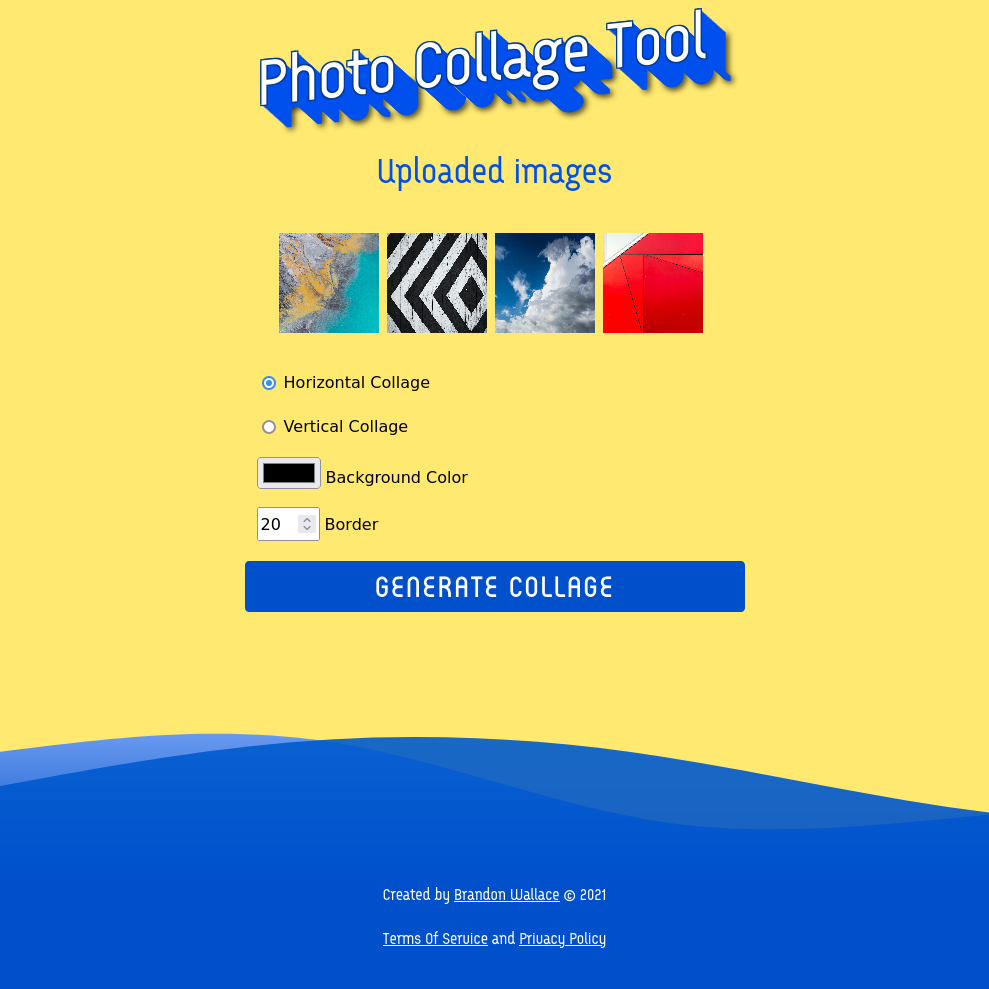
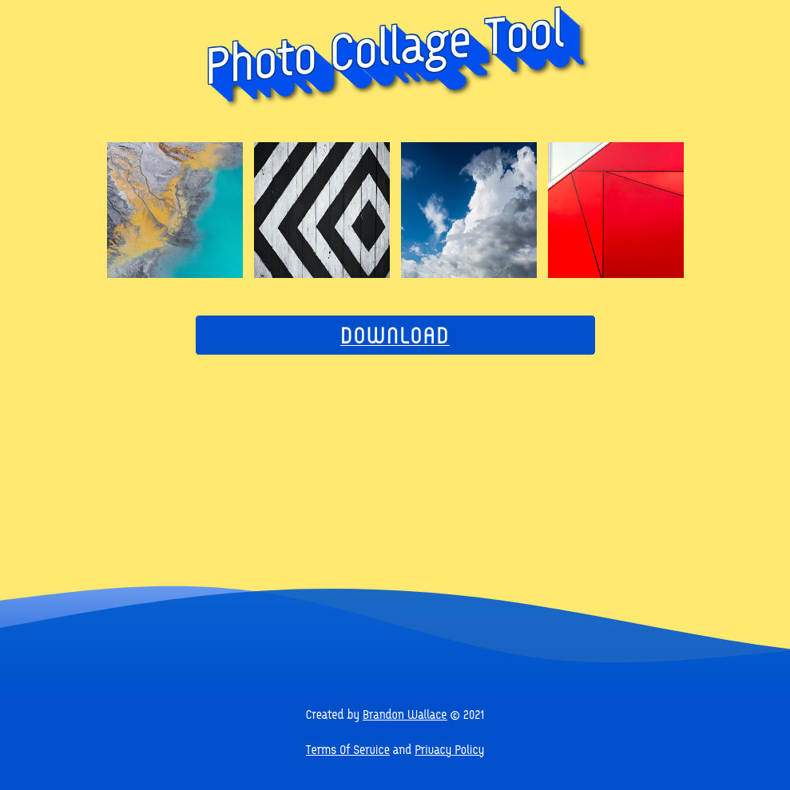

# DevProjects - Photo Collage Tool

## Upload and combine images asynchronously using a task queue to create a photo collage horizontally or vertically with the option to set a border and background color. 

This is an open source project from [DevProjects](http://www.codementor.io/projects). Feedback and questions are welcome!

Find the project requirements here: [Online photo collage tool](https://www.codementor.io/projects/web/online-photo-collage-tool-atx32mwend)

## Technologies used

Built with:

* Python3 
* Flask 
* RabbitMQ 
* Celery 
* Pillow 
* Numpy

## Screenshot 






## Example Images 


## Installation

Create a .env file.
```
$ vim .env

# Add the following lines.

FLASK_APP=run.py
FLASK_ENV=development
SECRET_KEY=<your_secret_key>
CELERY_RESULT_BACKEND='rpc://'  # For RabbitMQ
CELERY_BROKER_URL='<your_rabbitmq_url>'
UPLOADED_IMAGES_DEST='application/static/images/uploads'
DOWNLOAD_URL='</full/path/to/images>'
```

```
$ sudo apt install rabbitmq-server
```

Enable and start the rabbitmq server.

```
$ sudo systemctl enable rabbitmq-server
$ sudo systemctl start rabbitmq-server
```

Check status of the server.

```
$ sudo systemctl status rabbitmq-server
```

Start a celery worker.

```
$ celery -A application.tasks worker --loglevel=INFO
```

In another terminal start the application.

```
$ flask run
```

Browse to http://127.0.0.1:5000


## License

[GPL3](https://choosealicense.com/licenses/gpl-3.0/)
Most open source projects use the GPL3 license.
